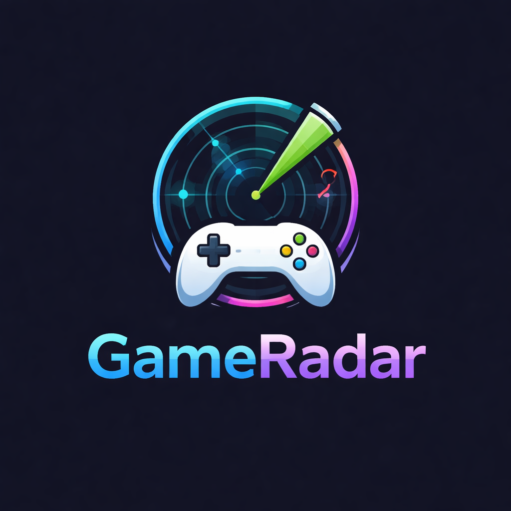

# 🎮 GameRadar

<p align="center">
  
</p>

## 🚀 Description

GameRadar is a modern gaming info web app that allows users to explore video games using a public API. Users can search games, filter by platform and genre, sort results, and save favorites.

---

## ✨ Features

* 🔍 Search games
* 🎯 Filter by platform & genre
* 🔃 Sort by rating & release date
* ⭐ Add/remove favorites
* 🌙 Dark mode
* ⚡ Debounced search
* 📄 Game details modal
* 📱 Fully responsive UI

---

## 🛠 Tech Stack

* HTML
* CSS
* JavaScript
* Fetch API
* Local Storage

---

## 🌐 API Used

RAWG Video Games Database API

---

## 📦 Project Structure

```
gaming-info-app/
│── index.html
│── style.css
│── script.js
│── assets/
│   └── logo.png
│── README.md
```

---

## ▶️ How to Run

1. Clone the repository
2. Add your API key in `script.js`
3. Open `index.html`

---

## 🔥 Future Improvements

* Pagination
* Infinite scroll
* Game trailers
* UI animations

---

## 👨‍💻 Author

Narendar Kumar
